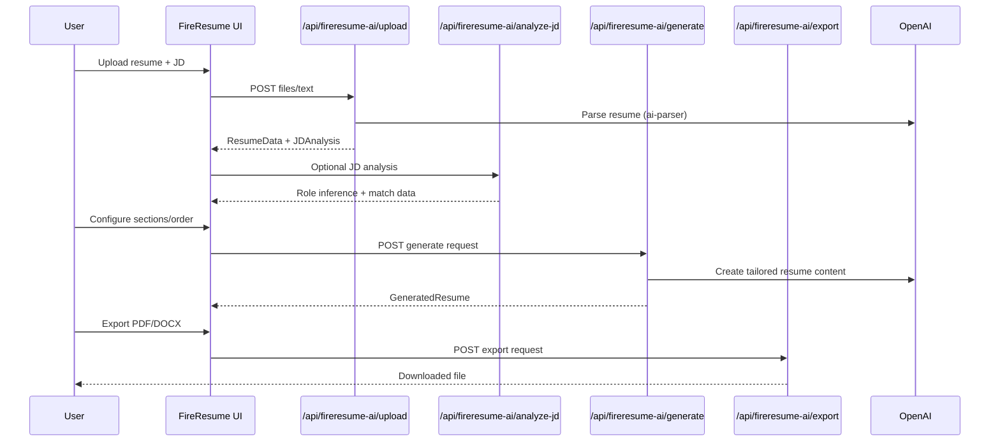

# FireResume AI (Day 4 of 30 Days of Product)

ATS-friendly resume tailoring with JD analysis and exports.

## Live demo
- Visit https://lawrencehua.com/fireresume-ai

## Problem & Solution
- **Problem:** Tailoring resumes to each JD is slow and often fails ATS scans.
- **Solution:** Upload resume + JD, analyze gaps, configure sections, and export ATS-friendly docs.

## What’s inside
- Standalone Next.js app with upload → configure → preview → export flow.
- APIs: `/upload`, `/analyze-jd`, `/generate`, `/export` backed by `lib/fireresume-ai/*`.
- FireResume-specific components and types; `.env.example` placeholders to fill.

## Run locally
1. Install deps: `npm install`
2. Copy `.env.example` to `.env` and provide your values
3. Start dev server: `npm run dev`
4. Open `http://localhost:3000`

## Notes
- For demos, use the live link above.
- Repo name: FireResume AI (Day 4 of 30 Days of Product)

## Architecture
```mermaid
flowchart TD
  U[User] --> UI[Next.js UI]
  UI --> API1[/api/fireresume-ai/upload]
  UI --> API2[/api/fireresume-ai/analyze-jd]
  UI --> API3[/api/fireresume-ai/generate]
  UI --> API4[/api/fireresume-ai/export]
  API1 --> L[lib/fireresume-ai]
  API2 --> L
  API3 --> L
  API4 --> L
  L --> OAI[OpenAI API]
  UI --> CMP[components/fireresume-ai/*]
  UI --> TYPES[types/fireresume-ai]
```

## Sequence

